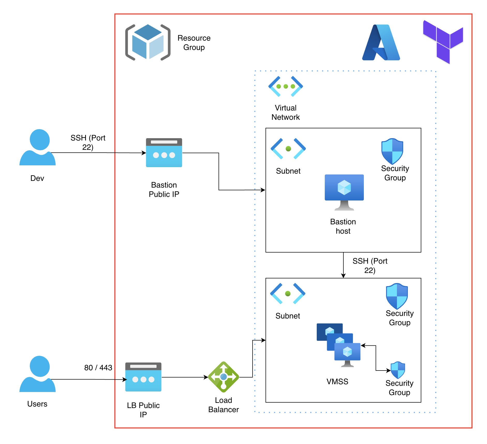

# Terraform Azure Load Balancer Project

## Overview
This project demonstrates Infrastructure Deployment of an Azure Load Balancer and its associated resources using Terraform. It sets up a highly available architecture with a Virtual Machine Scale Set (VMSS), public IP address, backend address pools, health probes, and necessary security configurations.

This will be the core concept, can be applied for any website or application

## Architecture Diagram


## Features
- **Automate Deployment on Azure**
- **Manage Infrastructure using Terraform and Ansible**
- **Virtual Machine Scale Set (VMSS)**: Deploys a scalable set of Linux VMs with HTTP server configurations.
- **Load Balancer**: Distributes incoming traffic to the VMSS instances.
- **Network Security Groups (NSG)**: Manages inbound and outbound traffic rules for security.
- **Dynamic Configuration**: Utilizes dynamic blocks for flexible configuration of security rules and other resources.

## Files Overview
The project consists of the following Terraform files:

- **bastion-resource.tf**: Defines the Azure Bastion and its associated resources.
- **bastion-ssh-keys.tf**: Contains the SSH keys for the Bastion host.
- **bastion-subnet-and-nsg.tf**: Configures the subnet and network security group (NSG) for the Bastion host.
- **loadbalancer-resource.tf**: Defines the Azure Load Balancer and its associated resources.
- **locals.tf**: Contains local variables used throughout the project.
- **network-subnet-nsg.tf**: Configures the subnet and NSG for the web tier.
- **outputs.tf**: Defines output values from the Terraform configuration.
- **random-resources.tf**: Configures any random resources needed for the deployment.
- **resource-group.tf**: Creates the Azure Resource Group for the resources.
- **terraform.tfvars**: Contains variable values used in the Terraform configuration.
- **variables.tf**: Defines input variables for the project.
- **vmss-autoscale-profile.tf**: Configures the autoscaling settings for the VMSS.
- **vmss-nsg.tf**: Creates the NSG for the VMSS.
- **vmss-resource.tf**: Defines the VMSS resources and configuration.
- **versions.tf**: Specifies required Terraform and provider versions.

## Preparation
- [Terraform](https://www.terraform.io/downloads.html) installed
    - Ubuntu
    ```
    wget -O- https://apt.releases.hashicorp.com/gpg | sudo gpg --dearmor -o /usr/share/keyrings/hashicorp-archive-keyring.gpg
    echo "deb [signed-by=/usr/share/keyrings/hashicorp-archive-keyring.gpg] https://apt.releases.hashicorp.com $(lsb_release -cs) main" | sudo tee /etc/apt/sources.list.d/hashicorp.list
    sudo apt update && sudo apt install terraform
    ```
    - MacOS
    ```
    brew tap hashicorp/tap
    brew install hashicorp/tap/terraform
    ```
- Azure subscription
- Azure CLI installed and configured

## Getting Started

### Step 1: Clone the repository
```bash
git clone https://github.com/htrungngx/Infrastructure-on-Azure.git
cd terraform-azure-lb
```

### Step 2: Initialize Terraform
```bash
terraform init
```

### Step 3: Configure variables
Edit the `variables.tf` file or create a `terraform.tfvars` file to customize input variables for your deployment.

### Step 4: Plan the deployment
```bash
terraform plan
```

### Step 5: Apply the configuration
```bash
terraform apply
```

### Step 6: Access the deployed application
Once the deployment is complete, you can access your application via the public IP address of the load balancer.

## Cleanup
To remove all resources created by Terraform, run:
```bash
terraform destroy
```


